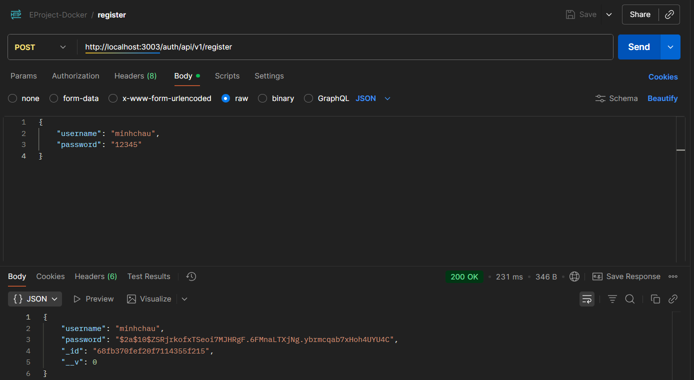
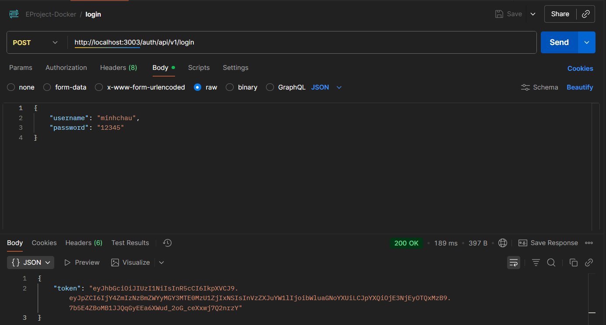
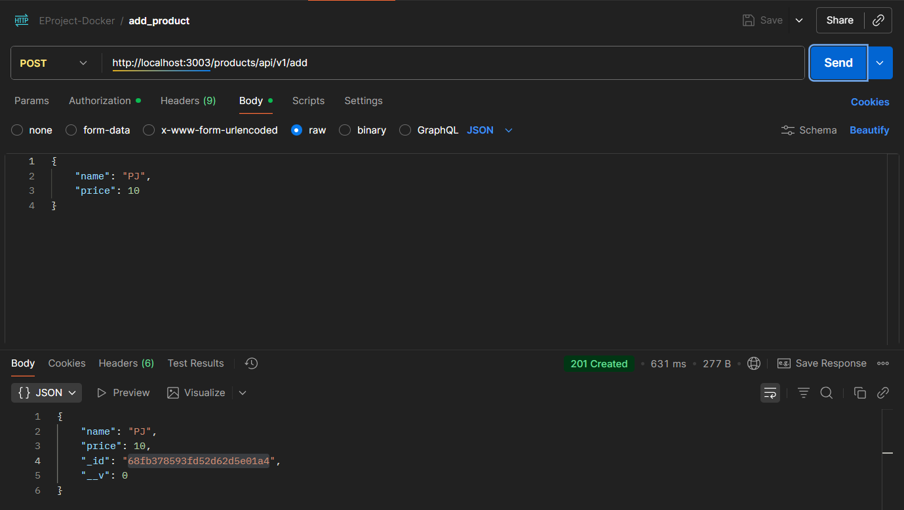
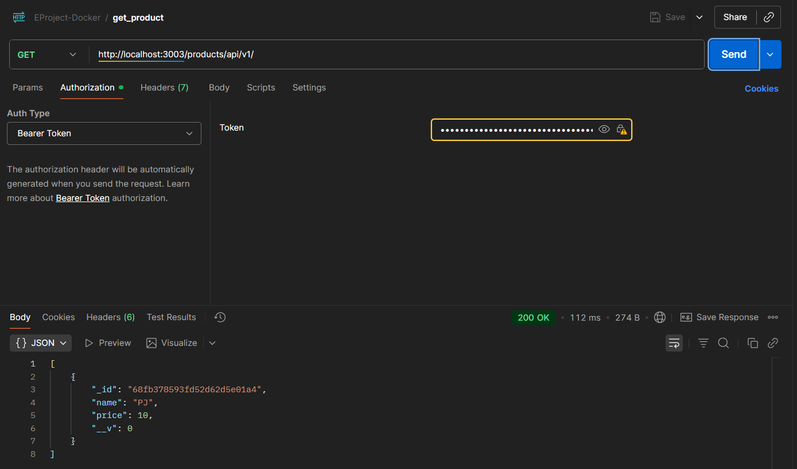
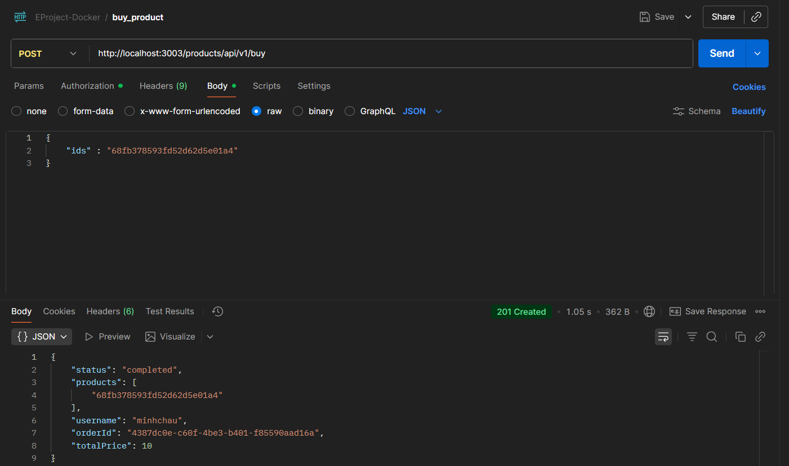
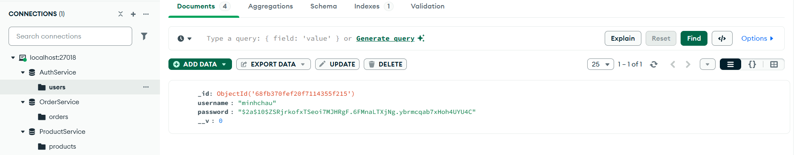
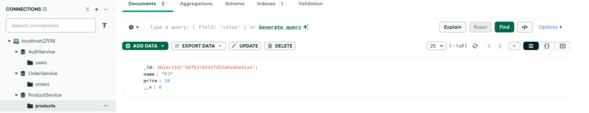
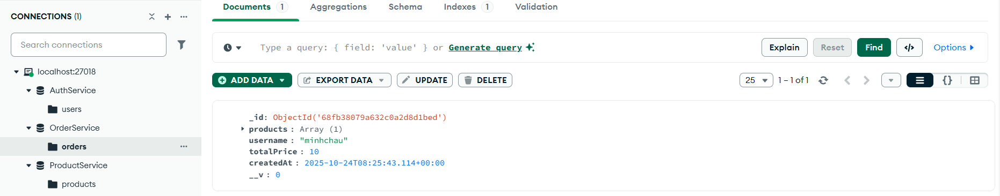

# EProject - Microservices with Docker

## Overview
This project is a **Microservices-based E-Commerce System** built with **Node.js**, **Express**, **MongoDB**, and **RabbitMQ**, deployed using **Docker Compose**.  
It consists of multiple independent services communicating asynchronously via message queues and synchronously through an API Gateway.

## Architecture

```
├── 📁 .github

│   └── 📁 workflows

│       └── ⚙️ ci-cd.yml

├── 📁 api-gateway

│   ├── 🐳 Dockerfile

│   ├── 📄 index.js

│   └── ⚙️ package.json

├── 📁 auth

│   ├── 📁 src

│   │   ├── 📁 config


│   │   │   └── 📄 index.js

│   │   ├── 📁 controllers

│   │   │   └── 📄 authController.js

│   │   ├── 📁 middlewares

│   │   │   └── 📄 authMiddleware.js

│   │   ├── 📁 models

│   │   │   └── 📄 user.js

│   │   ├── 📁 repositories

│   │   │   └── 📄 userRepository.js

│   │   ├── 📁 services

│   │   │   └── 📄 authService.js

│   │   ├── 📁 test

│   │   │   └── 📄 authController.test.js

│   │   └── 📄 app.js

│   ├── 🐳 Dockerfile

│   ├── 📄 index.js

│   └── ⚙️ package.json

├── 📁 order

│   ├── 📁 src

│   │   ├── 📁 models

│   │   │   └── 📄 order.js

│   │   ├── 📁 utils

│   │   │   ├── 📄 isAuthenticated.js

│   │   │   └── 📄 messageBroker.js

│   │   ├── 📄 app.js

│   │   └── 📄 config.js

│   ├── 🐳 Dockerfile

│   ├── 📄 index.js

│   └── ⚙️ package.json

├── 📁 product

│   ├── 📁 src

│   │   ├── 📁 controllers

│   │   │   └── 📄 productController.js

│   │   ├── 📁 models

│   │   │   └── 📄 product.js

│   │   ├── 📁 repositories

│   │   │   └── 📄 productsRepository.js

│   │   ├── 📁 routes

│   │   │   └── 📄 productRoutes.js

│   │   ├── 📁 services

│   │   │   └── 📄 productsService.js

│   │   ├── 📁 test

│   │   │   └── 📄 product.test.js

│   │   ├── 📁 utils

│   │   │   ├── 📄 isAuthenticated.js

│   │   │   └── 📄 messageBroker.js

│   │   ├── 📄 app.js

│   │   └── 📄 config.js

│   ├── 🐳 Dockerfile

│   ├── 📄 index.js

│   └── ⚙️ package.json

├── 📁 public

│   └── 📁 result

├── 📁 rabbitmq

│   └── 🐳 Dockerfile

├── 📁 utils

│   └── 📄 isAuthenticated.js

├── ⚙️ .gitignore


├── 📝 README.md

├── ⚙️ docker-compose.yml

└── ⚙️ package.json
```


## Technologies

- **Node.js 22.x**

- **Express.js**

- **MongoDB 6.0**

- **RabbitMQ 4.x (Management Plugin)**

- **Docker Compose 3.9**

- **Mongoose (ODM)**

- **AMQP / amqplib**


## Run Project

1️⃣ Clone repository
```
git clone https://github.com/<username>/EProject-Docker.git
cd EProject-Docker
```

2️⃣ Build and start containers
```
docker-compose up --build
```

3️⃣ Check running services
```
docker-compose ps
```

## Testing the APIs with Postman
1. Register: POST | http://localhost:3003/auth/api/v1/register


2. Login: POST | http://localhost:3003/auth/api/v1/login


3. Add product: POST | http://localhost:3003/products/api/v1/add


4. Get product: GET | http://localhost:3003/products/api/v1/


5. Buy prodcut: POST http://localhost:3003/products/api/v1/buy


## RabbitMQ Management UI

Access the RabbitMQ dashboard:
```
http://localhost:15672
```
Login credentials:
```
Username: guest
Password: guest
```
Queues like /products and /orders will appear once services start exchanging messages.


## MongoDB Access
```
mongodb://localhost:27018
```
### Databases: 
AuthService


ProductService 


OrderService


# Author: 22702721 - Tran Phuc Minh Chau